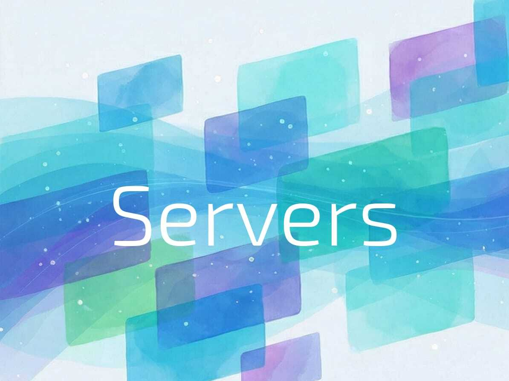
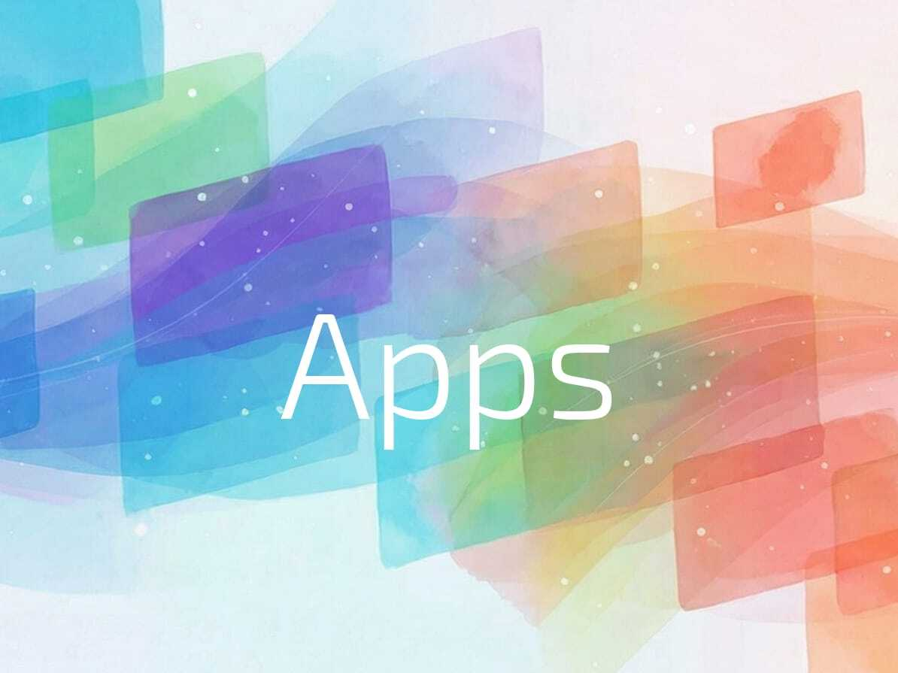
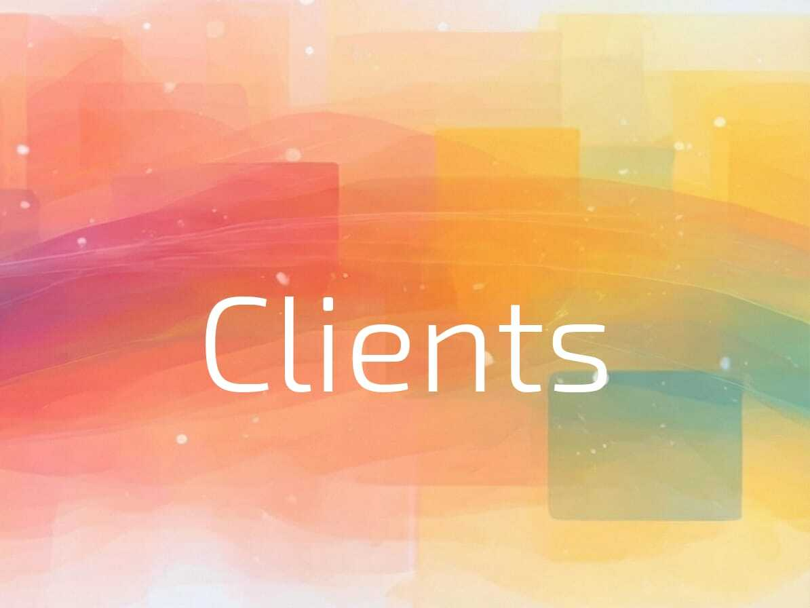

<div align="center">

<!-- omit in toc -->

<picture>
  <source width="550" media="(prefers-color-scheme: dark)" srcset="docs/assets/brand/f-watercolor-waves-dark-2.jpeg">
  <source width="550" media="(prefers-color-scheme: light)" srcset="docs/assets/brand/f-watercolor-waves-2.png">
  
</picture>

# FastMCP 🚀

<strong>Move fast and make things.</strong>

*Made with 💙 by [Prefect](https://www.prefect.io/)*

[](https://gofastmcp.com)
[](https://discord.gg/uu8dJCgttd)
[](https://pypi.org/project/fastmcp)
[](https://github.com/jlowin/fastmcp/actions/workflows/run-tests.yml)
[](https://github.com/jlowin/fastmcp/blob/main/LICENSE)

<a href="https://trendshift.io/repositories/13266" target="_blank"></a>
</div>

---

The [Model Context Protocol](https://modelcontextprotocol.io) (MCP) provides a standardized way to connect AI agents to tools and data. FastMCP makes it easy to build MCP applications with clean, Pythonic code:

```python
from fastmcp import FastMCP

mcp = FastMCP("Demo 🚀")

@mcp.tool
def add(a: int, b: int) -> int:
    """Add two numbers"""
    return a + b

if __name__ == "__main__":
    mcp.run()
```

## Why FastMCP

The [Model Context Protocol](https://modelcontextprotocol.io/) (MCP) lets you give agents access to your tools and data. But building an effective MCP application is harder than it looks.

FastMCP handles all of it. Declare a tool with a Python function, and the schema, validation, and documentation are generated automatically. Connect to a server with a URL, and transport negotiation, authentication, and protocol lifecycle are managed for you. You focus on your logic, and the MCP part just works: **with FastMCP, best practices are built in.**

**That's why FastMCP is the standard framework for working with MCP.** FastMCP 1.0 was incorporated into the official MCP SDK in 2024. Today, the actively maintained standalone project is downloaded a million times a day, and some version of FastMCP powers 70% of MCP servers across all languages.

FastMCP has three pillars:

<table>
<tr>
<td align="center" valign="top" width="33%">
<a href="https://gofastmcp.com/servers/server">

<br /><strong>Servers</strong>
</a>
<br />Expose tools, resources, and prompts to LLMs.
</td>
<td align="center" valign="top" width="33%">
<a href="https://gofastmcp.com/apps/overview">

<br /><strong>Apps</strong>
</a>
<br />Give your tools interactive UIs rendered directly in the conversation.
</td>
<td align="center" valign="top" width="33%">
<a href="https://gofastmcp.com/clients/client">

<br /><strong>Clients</strong>
</a>
<br />Connect to any MCP server — local or remote, programmatic or CLI.
</td>
</tr>
</table>

**[Servers](https://gofastmcp.com/servers/server)** wrap your Python functions into MCP-compliant tools, resources, and prompts. **[Clients](https://gofastmcp.com/clients/client)** connect to any server with full protocol support. And **[Apps](https://gofastmcp.com/apps/overview)** give your tools interactive UIs rendered directly in the conversation.

**Move fast and make things.**

## Installation

> [!Note]
> FastMCP 3.0 is currently a release candidate. Install with: `pip install fastmcp==3.0.0rc1`
>
> For production systems requiring stability, pin to v2: `pip install 'fastmcp<3'`

We recommend installing FastMCP with [uv](https://docs.astral.sh/uv/):

```bash
uv pip install fastmcp
```

For full installation instructions, including verification and upgrading, see the [**Installation Guide**](https://gofastmcp.com/getting-started/installation).

## 📚 Documentation

FastMCP's complete documentation is available at **[gofastmcp.com](https://gofastmcp.com)**, including detailed guides, API references, and advanced patterns.

Documentation is also available in [llms.txt format](https://llmstxt.org/), which is a simple markdown standard that LLMs can consume easily:

- [`llms.txt`](https://gofastmcp.com/llms.txt) is essentially a sitemap, listing all the pages in the documentation.
- [`llms-full.txt`](https://gofastmcp.com/llms-full.txt) contains the entire documentation. Note this may exceed the context window of your LLM.

**Community:** Join our [Discord server](https://discord.gg/uu8dJCgttd) to connect with other FastMCP developers and share what you're building.

## Contributing

We welcome contributions! See the [Contributing Guide](https://gofastmcp.com/development/contributing) for setup instructions, testing requirements, and PR guidelines.
