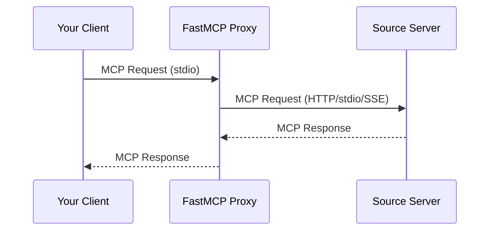

import { VersionBadge } from '/snippets/version-badge.mdx'

<VersionBadge version="2.0.0" />

The Proxy Provider sources components from another MCP server through a client connection. This lets you expose any MCP server's tools, resources, and prompts through your own server, whether the source is local or accessed over the network.

## Why Use Proxy Provider

The Proxy Provider enables:

- **Bridge transports**: Make an HTTP server available via stdio, or vice versa
- **Aggregate servers**: Combine multiple source servers into one unified server
- **Add security**: Act as a controlled gateway with authentication and authorization
- **Simplify access**: Provide a stable endpoint even if backend servers change



## Quick Start

<VersionBadge version="2.10.3" />

Create a proxy using `create_proxy()`:

```python
from fastmcp.server import create_proxy

# create_proxy() accepts URLs, file paths, and transports directly
proxy = create_proxy("http://example.com/mcp", name="MyProxy")

if __name__ == "__main__":
    proxy.run()
```

This gives you:
- Safe concurrent request handling
- Automatic forwarding of MCP features (sampling, elicitation, etc.)
- Session isolation to prevent context mixing

<Tip>
To mount a proxy inside another FastMCP server, see [Mounting External Servers](/servers/providers/mounting#mounting-external-servers).
</Tip>

## Transport Bridging

A common use case is bridging transports between servers:

```python
from fastmcp.server import create_proxy

# Bridge HTTP server to local stdio
http_proxy = create_proxy("http://example.com/mcp/sse", name="HTTP-to-stdio")

# Run locally via stdio for Claude Desktop
if __name__ == "__main__":
    http_proxy.run()  # Defaults to stdio
```

Or expose a local server via HTTP:

```python
from fastmcp.server import create_proxy

# Bridge local server to HTTP
local_proxy = create_proxy("local_server.py", name="stdio-to-HTTP")

if __name__ == "__main__":
    local_proxy.run(transport="http", host="0.0.0.0", port=8080)
```

## Session Isolation

<VersionBadge version="2.10.3" />

`create_proxy()` provides session isolation - each request gets its own isolated backend session:

```python
from fastmcp.server import create_proxy

# Each request creates a fresh backend session (recommended)
proxy = create_proxy("backend_server.py")

# Multiple clients can use this proxy simultaneously:
# - Client A calls a tool → gets isolated session
# - Client B calls a tool → gets different session
# - No context mixing
```

### Shared Sessions

If you pass an already-connected client, the proxy reuses that session:

```python
from fastmcp import Client
from fastmcp.server import create_proxy

async with Client("backend_server.py") as connected_client:
    # This proxy reuses the connected session
    proxy = create_proxy(connected_client)

    # ⚠️ Warning: All requests share the same session
```

<Warning>
Shared sessions may cause context mixing in concurrent scenarios. Use only in single-threaded situations or with explicit synchronization.
</Warning>

## MCP Feature Forwarding

<VersionBadge version="2.10.3" />

Proxies automatically forward MCP protocol features:

| Feature | Description |
|---------|-------------|
| Roots | Filesystem root access requests |
| Sampling | LLM completion requests |
| Elicitation | User input requests |
| Logging | Log messages from backend |
| Progress | Progress notifications |

```python
from fastmcp.server import create_proxy

# All features forwarded automatically
proxy = create_proxy("advanced_backend.py")

# When the backend:
# - Requests LLM sampling → forwarded to your client
# - Logs messages → appear in your client
# - Reports progress → shown in your client
```

### Disabling Features

Selectively disable forwarding:

```python
from fastmcp.server.providers.proxy import ProxyClient

backend = ProxyClient(
    "backend_server.py",
    sampling_handler=None,  # Disable LLM sampling
    log_handler=None        # Disable log forwarding
)
```

## Configuration-Based Proxies

<VersionBadge version="2.4.0" />

Create proxies from configuration dictionaries:

```python
from fastmcp.server import create_proxy

config = {
    "mcpServers": {
        "default": {
            "url": "https://example.com/mcp",
            "transport": "http"
        }
    }
}

proxy = create_proxy(config, name="Config-Based Proxy")
```

### Multi-Server Proxies

Combine multiple servers with automatic namespacing:

```python
from fastmcp.server import create_proxy

config = {
    "mcpServers": {
        "weather": {
            "url": "https://weather-api.example.com/mcp",
            "transport": "http"
        },
        "calendar": {
            "url": "https://calendar-api.example.com/mcp",
            "transport": "http"
        }
    }
}

# Creates unified proxy with prefixed components:
# - weather_get_forecast
# - calendar_add_event
composite = create_proxy(config, name="Composite")
```

## Component Prefixing

Proxied components follow standard prefixing rules:

| Component Type | Pattern |
|----------------|---------|
| Tools | `{prefix}_{tool_name}` |
| Prompts | `{prefix}_{prompt_name}` |
| Resources | `protocol://{prefix}/path` |
| Templates | `protocol://{prefix}/...` |

## Mirrored Components

<VersionBadge version="2.10.5" />

Components from a proxy server are "mirrored" - they reflect the remote server's state and cannot be modified directly.

To modify a proxied component (like disabling it), create a local copy:

```python
from fastmcp import FastMCP
from fastmcp.server import create_proxy

proxy = create_proxy("backend_server.py")

# Get mirrored tool
mirrored_tool = await proxy.get_tool("useful_tool")

# Create modifiable local copy
local_tool = mirrored_tool.copy()

# Add to your own server
my_server = FastMCP("MyServer")
my_server.add_tool(local_tool)

# Now you can control enabled state
my_server.disable(keys={local_tool.key})
```

## Performance Considerations

Proxying introduces network latency:

| Operation | Local | Proxied (HTTP) |
|-----------|-------|----------------|
| `list_tools()` | 1-2ms | 300-400ms |
| `call_tool()` | 1-2ms | 200-500ms |

When mounting proxy servers, this latency affects all operations on the parent server.

For low-latency requirements, consider using [`import_server()`](/servers/providers/mounting#static-importing) to copy tools at startup.

## Advanced Usage

### FastMCPProxy Class

For explicit session control, use `FastMCPProxy` directly:

```python
from fastmcp.server.providers.proxy import FastMCPProxy, ProxyClient

# Custom session factory
def create_client():
    return ProxyClient("backend_server.py")

proxy = FastMCPProxy(client_factory=create_client)
```

This gives you full control over session creation and reuse strategies.

### Adding Proxied Components to Existing Server

Mount a proxy to add components from another server:

```python
from fastmcp import FastMCP
from fastmcp.server import create_proxy

server = FastMCP("My Server")

# Add local tools
@server.tool
def local_tool() -> str:
    return "Local result"

# Mount proxied tools from another server
external = create_proxy("http://external-server/mcp")
server.mount(external)

# Now server has both local and proxied tools
```
