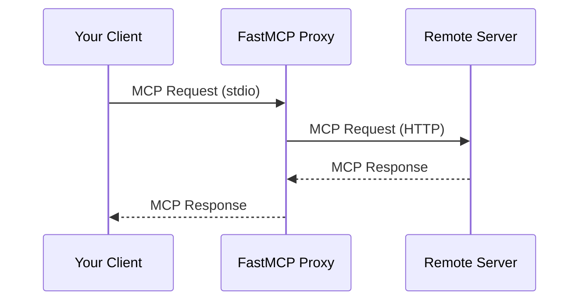

import { VersionBadge } from '/snippets/version-badge.mdx'

<VersionBadge version="2.0.0" />

Proxying lets you expose a remote MCP server's tools, resources, and prompts through your local server. Under the hood, FastMCP uses `ProxyProvider` (v3.0.0+) to source components from a client connection.

## Why Proxy Servers

Proxying lets you:

- **Bridge transports**: Expose a remote SSE server via local stdio
- **Aggregate servers**: Combine multiple remote servers into one
- **Add security**: Act as a controlled gateway to backend servers
- **Simplify access**: Single endpoint even if backends change



## Quick Start

<VersionBadge version="2.10.3" />

Create a proxy using `FastMCP.as_proxy()`:

```python
from fastmcp import FastMCP
from fastmcp.server.proxy import ProxyClient

# Create a proxy to a remote server
proxy = FastMCP.as_proxy(
    ProxyClient("http://example.com/mcp"),
    name="MyProxy"
)

if __name__ == "__main__":
    proxy.run()
```

This gives you:
- Safe concurrent request handling
- Automatic forwarding of MCP features (sampling, elicitation, etc.)
- Session isolation to prevent context mixing

## Transport Bridging

A common use case is bridging transports - making a remote server available locally:

```python
from fastmcp import FastMCP
from fastmcp.server.proxy import ProxyClient

# Bridge remote HTTP to local stdio
remote_proxy = FastMCP.as_proxy(
    ProxyClient("http://example.com/mcp/sse"),
    name="Remote-to-Local"
)

# Run locally via stdio for Claude Desktop
if __name__ == "__main__":
    remote_proxy.run()  # Defaults to stdio
```

Or expose a local server via HTTP:

```python
# Bridge local server to HTTP
local_proxy = FastMCP.as_proxy(
    ProxyClient("local_server.py"),
    name="Local-to-HTTP"
)

if __name__ == "__main__":
    local_proxy.run(transport="http", host="0.0.0.0", port=8080)
```

## Session Isolation

<VersionBadge version="2.10.3" />

ProxyClient provides session isolation - each request gets its own isolated backend session:

```python
from fastmcp.server.proxy import ProxyClient

# Each request creates a fresh backend session (recommended)
proxy = FastMCP.as_proxy(ProxyClient("backend_server.py"))

# Multiple clients can use this proxy simultaneously:
# - Client A calls a tool → gets isolated session
# - Client B calls a tool → gets different session
# - No context mixing
```

### Shared Sessions

If you pass an already-connected client, the proxy reuses that session:

```python
from fastmcp import Client

async with Client("backend_server.py") as connected_client:
    # This proxy reuses the connected session
    proxy = FastMCP.as_proxy(connected_client)

    # ⚠️ Warning: All requests share the same session
```

<Warning>
Shared sessions may cause context mixing in concurrent scenarios. Use only in single-threaded situations or with explicit synchronization.
</Warning>

## MCP Feature Forwarding

<VersionBadge version="2.10.3" />

ProxyClient automatically forwards MCP protocol features:

| Feature | Description |
|---------|-------------|
| Roots | Filesystem root access requests |
| Sampling | LLM completion requests |
| Elicitation | User input requests |
| Logging | Log messages from backend |
| Progress | Progress notifications |

```python
from fastmcp.server.proxy import ProxyClient

# All features forwarded automatically
backend = ProxyClient("advanced_backend.py")
proxy = FastMCP.as_proxy(backend)

# When the backend:
# - Requests LLM sampling → forwarded to your client
# - Logs messages → appear in your client
# - Reports progress → shown in your client
```

### Disabling Features

Selectively disable forwarding:

```python
backend = ProxyClient(
    "backend_server.py",
    sampling_handler=None,  # Disable LLM sampling
    log_handler=None        # Disable log forwarding
)
```

## Configuration-Based Proxies

<VersionBadge version="2.4.0" />

Create proxies from configuration dictionaries:

```python
from fastmcp import FastMCP

config = {
    "mcpServers": {
        "default": {
            "url": "https://example.com/mcp",
            "transport": "http"
        }
    }
}

proxy = FastMCP.as_proxy(config, name="Config-Based Proxy")
```

### Multi-Server Proxies

Combine multiple servers with automatic namespacing:

```python
config = {
    "mcpServers": {
        "weather": {
            "url": "https://weather-api.example.com/mcp",
            "transport": "http"
        },
        "calendar": {
            "url": "https://calendar-api.example.com/mcp",
            "transport": "http"
        }
    }
}

# Creates unified proxy with prefixed components:
# - weather_get_forecast
# - calendar_add_event
composite = FastMCP.as_proxy(config, name="Composite")
```

## Component Prefixing

Proxied components follow standard prefixing rules:

| Component Type | Pattern |
|----------------|---------|
| Tools | `{prefix}_{tool_name}` |
| Prompts | `{prefix}_{prompt_name}` |
| Resources | `protocol://{prefix}/path` |
| Templates | `protocol://{prefix}/...` |

## Mirrored Components

<VersionBadge version="2.10.5" />

Components from a proxy server are "mirrored" - they reflect the remote server's state and cannot be modified directly.

To modify a proxied component (like disabling it), create a local copy:

```python
proxy = FastMCP.as_proxy("backend_server.py")

# Get mirrored tool
mirrored_tool = await proxy.get_tool("useful_tool")

# Create modifiable local copy
local_tool = mirrored_tool.copy()

# Add to your own server
my_server = FastMCP("MyServer")
my_server.add_tool(local_tool)

# Now you can control visibility
my_server.disable(keys=[local_tool.key])
```

## Performance Considerations

Proxying introduces network latency:

| Operation | Local | Proxied (HTTP) |
|-----------|-------|----------------|
| `list_tools()` | 1-2ms | 300-400ms |
| `call_tool()` | 1-2ms | 200-500ms |

When mounting proxy servers, this latency affects all operations on the parent server.

For low-latency requirements, consider using [`import_server()`](/servers/providers/mounting#static-importing) to copy tools at startup.

## Advanced: FastMCPProxy Class

For explicit session control, use `FastMCPProxy` directly:

```python
from fastmcp.server.proxy import FastMCPProxy, ProxyClient

# Custom session factory
def create_client():
    return ProxyClient("backend_server.py")

proxy = FastMCPProxy(client_factory=create_client)
```

This gives you full control over session creation and reuse strategies.
